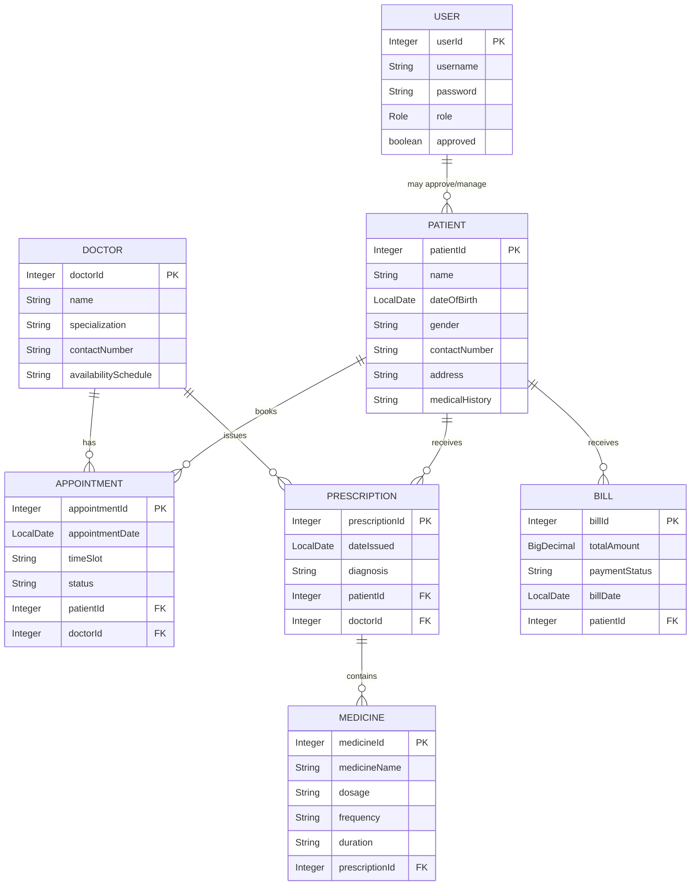
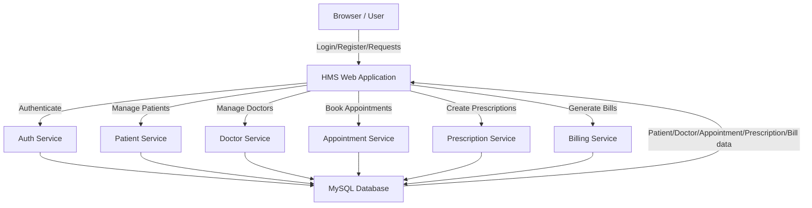

# Hospital Management System (HMS)

## 1. Project Overview

This is a Spring Boot-based Hospital Management System packaged as a WAR for deployment on Tomcat. It includes:

- User management (admin/patient/doctor approval)
- Patient management
- Doctor management
- Appointment scheduling
- Prescription management
- Billing tracking

The backend uses Spring Boot 3.2.5, Spring Data JPA, and MySQL.

## 2. Key Files

- `pom.xml` - Maven build configuration
- `src/main/java/com/hms/HmsApplication.java` - Spring Boot entry point
- `src/main/resources/application.properties` - database and server settings
- `src/main/java/com/hms/model/*` - JPA entity classes
- `src/main/java/com/hms/controller/*` - REST controllers
- `src/main/webapp/WEB-INF/web.xml` - web deployment descriptor
- `src/main/resources/static` and `src/main/webapp/static` - frontend static assets

## 3. Environment Requirements

- Java JDK 17 installed
- Apache Maven installed, or use IntelliJ built-in Maven support
- MySQL server running
- Tomcat server for WAR deployment

## 4. Database Setup

The project expects a MySQL database named `hms`.

Example SQL:

```sql
CREATE DATABASE hms;
CREATE USER 'root'@'localhost' IDENTIFIED BY 'abishek';
GRANT ALL PRIVILEGES ON hms.* TO 'root'@'localhost';
FLUSH PRIVILEGES;
```

Update `src/main/resources/application.properties` if your MySQL user, password, host, or port differ.

## 5. Important Configuration to Change for Your Environment

1. `src/main/resources/application.properties`
   - `spring.datasource.url`
   - `spring.datasource.username`
   - `spring.datasource.password`
   - `spring.jpa.hibernate.ddl-auto` can be changed from `update` to `validate` or `none` in production.

2. Java version:
   - Set IDE project SDK to Java 17.
   - Ensure `java.version` in `pom.xml` is satisfied by your JDK.

3. Maven:
   - Install Maven if your shell does not already have `mvn`.
   - In IntelliJ, use built-in Maven support if you do not want a separate Maven install.

## 6. Running in IntelliJ

1. Open the project as a Maven project.
2. Set Project SDK to Java 17.
3. Re-import Maven dependencies.
4. Run `com.hms.HmsApplication` as a Spring Boot application.
5. Access the app at `http://localhost:8085/hms`.

> Note: `server.port=8085` is used only for the embedded Spring Boot server.

## 7. Running in Eclipse with Tomcat

1. Install Eclipse with Maven support (m2e).
2. Import the project:
   - File > Import > Existing Maven Projects
   - Select the root folder
3. Set the Java compiler compliance level to 17:
   - Project > Properties > Java Compiler > 17
4. Confirm project facets:
   - Project > Properties > Project Facets
   - Enable `Dynamic Web Module` and set Java to 17
5. Add the Tomcat runtime to Eclipse.
6. Add the project to the Tomcat server.
7. Build the WAR:
   - Right-click project > Run As > Maven install
   - Or use external Maven if installed
8. Deploy `target/hms.war` to Tomcat `webapps`.
9. Access the app at `http://localhost:8080/hms` (or Tomcat port).

> Note: When deployed to external Tomcat, Tomcat controls the HTTP port and context path. The `server.port` property is ignored by external Tomcat.

## 8. Running as a WAR in Tomcat

- The project is already configured for WAR packaging: `packaging>war</packaging>` in `pom.xml`.
- `HmsApplication` extends `SpringBootServletInitializer`, which is correct for Tomcat deployment.
- `spring-boot-starter-tomcat` is declared with `<scope>provided</scope>` so the embedded container is excluded from the WAR.

## 9. What I Found in This Workspace

- `pom.xml` is configured correctly for a Spring Boot WAR project.
- `HmsApplication` is ready for embedded and external Tomcat deployment.
- `application.properties` is set up for MySQL and context path `/hms`.
- The current terminal environment does not have `mvn` installed, so a direct shell build could not be verified here.
- Java is installed (`java 22` detected), but the project target is Java 17. Set your IDE to JDK 17 to avoid issues.

## 10. Suggested Changes for Smooth Eclipse/IntelliJ Use

- Install or enable Maven.
- Install JDK 17 and configure IDEs to use it.
- Verify MySQL database `hms` exists and credentials match.
- Use `target/hms.war` for Tomcat deployment if using Eclipse server.

## 11. Entity Relationship Diagram (ER Diagram)



## 12. Data Flow Diagram (DFD)



## 13. Quick Run Checklist

- [ ] Install JDK 17 and point Eclipse/IntelliJ to it
- [ ] Install Maven or use IntelliJ bundled Maven
- [ ] Create MySQL database `hms`
- [ ] Update `application.properties` credentials if needed
- [ ] Import the project as a Maven project
- [ ] Build the WAR with Maven
- [ ] Deploy to Tomcat or run `HmsApplication` directly

---

If you want, I can also add a small `maven-wrapper` to this repository so you can build without installing Maven globally.
